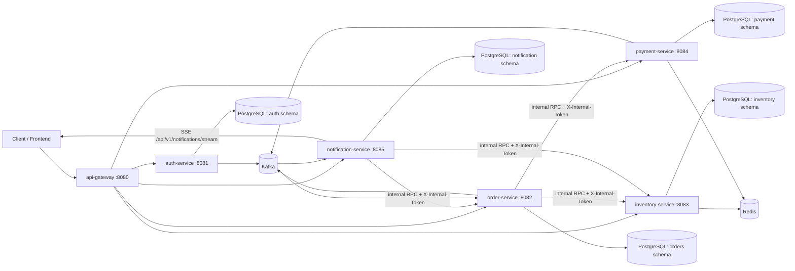

# Real-time Order Processing Platform - Architecture

## 1. Muc tieu

Tai lieu nay mo ta kien truc hien tai cua he thong theo code va cau hinh thuc te:

- Xu ly dat hang theo mo hinh microservices.
- Tach ro ranh gioi domain va ownership du lieu.
- Ket hop giao tiep dong bo (REST/internal RPC) va bat dong bo (Kafka).
- Ho tro realtime cho frontend qua SSE notification stream.

## 2. Boi canh he thong

He thong gom 6 backend services:

- `api-gateway`
- `auth-service`
- `order-service`
- `inventory-service`
- `payment-service`
- `notification-service`

Ha tang dung chung:

- PostgreSQL (moi service 1 schema rieng)
- Redis (cache + idempotency lock)
- Kafka (event bus)

## 3. Kien truc tong the

## 4. Service boundaries

| Service | Trach nhiem chinh | API public | API internal |
| --- | --- | --- | --- |
| `api-gateway` | Entry point, route theo domain, expose health route cho downstream | `/api/v1/*` route proxy | Khong co |
| `auth-service` | Identity, JWT, RBAC (role/permission/menu), user profile, partner-upgrade request | `/api/v1/auth/**` | Khong co |
| `order-service` | Tao don, state machine don hang, timeline, workflow reserve/payment timeout | `/api/v1/orders/**` | `/internal/v1/orders/{orderCode}/products` |
| `inventory-service` | Catalog san pham, danh muc, ton kho, reserve/release/confirm deduct | `/api/v1/inventories/**` | `/internal/v1/inventories/reserve|release|confirm-deduct|product-owners` |
| `payment-service` | Payment intent, xac nhan thanh toan, fail thanh toan, idempotency lock | `/api/v1/payments/**` | `/internal/v1/payments/intents|confirm|fail` |
| `notification-service` | Notification log, consume Kafka events, fanout SSE realtime, message conversation hub | `/api/v1/notifications/**`, `/api/v1/messages/**`, `/stream` | Khong expose endpoint rieng, goi RPC sang order/inventory de resolve recipient |

## 5. Kieu giao tiep

### 5.1 External sync

- Client luon di qua `api-gateway`.
- Public API theo prefix `/api/v1`.
- Auth duoc bao ve bang JWT.
- Message center (conversation/messages) cung di qua gateway va dung chung JWT context.

### 5.2 Internal sync (service-to-service)

- Dang dung internal HTTP API, client cau hinh HTTP/2 capable.
- Header bat buoc cho internal endpoint: `X-Internal-Token`.
- Cac luong chinh:
  - `order-service` -> `inventory-service`: reserve/release/confirm-deduct.
  - `order-service` -> `payment-service`: create payment intent.
  - `notification-service` -> `order-service` + `inventory-service`: resolve partner recipients theo `orderCode`.

### 5.3 Async event-driven

Producer/consumer chinh:

- `order-service` publish:
  - `order.lifecycle.created.v1`
  - `order.lifecycle.paid.v1`
  - `order.lifecycle.completed.v1`
  - `order.lifecycle.failed.v1`
- `payment-service` publish:
  - `payment.transaction.succeeded.v1`
  - `payment.transaction.failed.v1`
- `auth-service` publish:
  - `partner.request.created.v1`
  - `partner.request.decided.v1`
- `inventory-service` publish:
  - `product.review.created.v1`
  - `product.review.updated.v1`
  - `product.review.comment.created.v1`
- `order-service` consume payment topics de cap nhat state don.
- `notification-service` consume order/payment/partner/review topics de ghi log + day SSE.

## 6. Du lieu va ownership

Nguyen tac:

- Moi service so huu schema rieng, khong query truc tiep schema service khac.
- Dong bo state cross-service thong qua API/event.

Schema dang dung:

- `auth`
- `orders`
- `inventory`
- `payment`
- `notification`

Redis:

- `inventory-service`: cache du lieu ton kho (TTL cau hinh).
- `payment-service`: idempotency lock cho action `confirm`/`fail`.

## 7. Bao mat va phan quyen

- JWT duoc dung cho resource server o cac backend service.
- API partner/admin duoc rao quyen theo role/permission.
- Internal endpoint duoc tach rieng va bao ve boi `X-Internal-Token`.
- Gateway route health cua tung service qua `/actuator/*/health`.

## 8. Reliability va compensation

Nhung co che dang ap dung:

- Idempotency:
  - `Idempotency-Key` cho `POST /api/v1/orders`.
  - Redis idempotency lock cho payment confirm/fail.
- Payment timeout:
  - Order o state `RESERVED` qua han se auto release inventory va chuyen `FAILED`.
- Event envelope co `eventId`, `eventType`, `eventVersion`, `correlationId`.
- Notification consumer va order payment consumer co xu ly skip cho state conflict/not-found.

## 9. Trang thai kien truc hien tai

He thong dang theo huong orchestration + event:

- Orchestration chinh o `order-service` cho create order -> reserve -> payment intent.
- State payment cuoi cung duoc dong bo qua payment events.
- Notification la diem fanout realtime cho user/admin/partner.
- Messaging chat 1-1 duoc host tai `notification-service`, cap nhat thread qua SSE event `chat.message.created`.

Gioi han hien tai:

- Chua co outbox pattern.
- Chua co retry/DLQ processor day du trong application layer.
- Chua co integration test automation bao phu toan bo flow.
