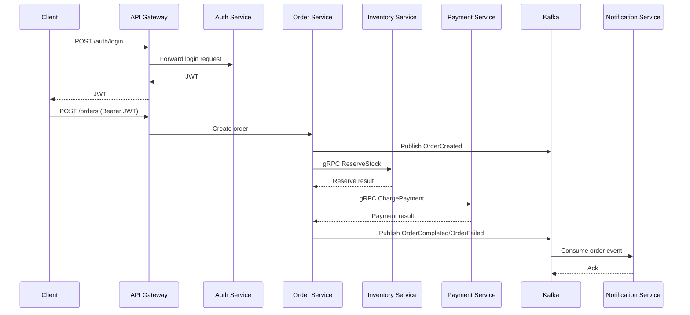

# Real-time Order Processing Platform - Architecture

## 1. Muc tieu

He thong nay duoc dung de luyen tap thiet ke va trien khai backend theo microservice voi:

- Spring Boot
- API Gateway
- gRPC (RPC tren HTTP/2)
- Kafka (event-driven)
- Redis (cache + idempotency + rate limit)
- PostgreSQL

Scope Week 1: dung skeleton + auth flow + convention de cac sprint sau trien khai nhanh.

## 2. Service Boundaries

| Service | Trach nhiem chinh | Du lieu so huu | Cach giao tiep |
| --- | --- | --- | --- |
| `api-gateway` | Entry point, route request, authn/authz middleware, rate limit | Khong so huu business data | HTTP/REST (external), HTTP/gRPC (internal) |
| `auth-service` | Dang ky, dang nhap, phat hanh JWT, xac thuc user | User, credentials, role | REST qua gateway |
| `order-service` | Tao don, quan ly state machine don hang | Order, order items, order state | REST (gateway), gRPC (inventory/payment), Kafka |
| `inventory-service` | Kiem tra ton kho, reserve/release stock | Stock ledger, reservation | gRPC, Kafka |
| `payment-service` | Xu ly thanh toan, cap nhat ket qua thanh toan | Payment transaction | gRPC, Kafka |
| `notification-service` | Gui thong bao (email/SMS/push) theo event | Notification log | Kafka consumer |

## 3. Communication Pattern

### 3.1 Sync

- Client -> `api-gateway`: REST/HTTP.
- `api-gateway` -> service: REST (giai doan dau).
- `order-service` -> `inventory-service`, `payment-service`: gRPC (Week 3).

### 3.2 Async

- Event bus trung tam: Kafka.
- Muc tieu: giam coupling, tang resilience cho flow dat hang.
- Cac event chinh: `OrderCreated`, `StockReserved`, `PaymentSucceeded`, `OrderCompleted`, `OrderFailed`.

## 4. Data Ownership

- Moi service so huu DB schema rieng.
- Khong query truc tiep bang cua service khac.
- Dong bo du lieu cross-service bang API/event, khong join cross-schema trong business flow.

## 5. High-level Flow (Target)

## 6. Reliability Rules (ap dung dan theo sprint)

- Timeout + retry voi dependency sync.
- Idempotency key cho API tao order.
- DLQ cho event xu ly that bai.
- Correlation ID xuyen suot request/event de trace.
- Outbox pattern (sprint reliability) de tranh mat event.

## 7. Day 1 Deliverables

- Co du 6 service Spring Boot boot thanh cong.
- Co tai lieu conventions: port, topic, API contract.
- Co `architecture.md` lam nguon su that cho team.
