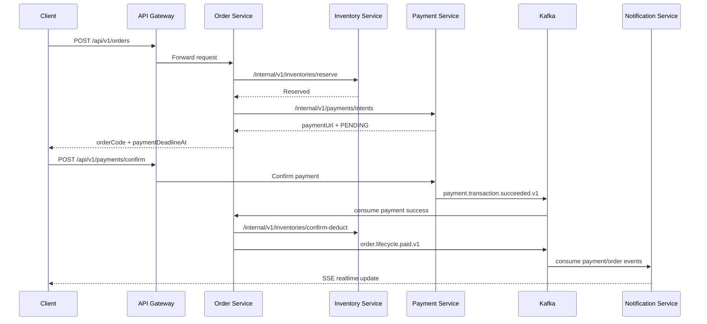

# Real-time Order Processing Platform - Key Flows

## 1. Muc tieu

Tai lieu nay tap trung vao cac luong nghiep vu quan trong va noi bat nhat cua he thong, theo implementation hien tai.

## 2. Flow 1 - Tao don hang va khoi tao thanh toan

Phat sinh tu:

- `POST /api/v1/orders` (qua gateway)

Trinh tu:

1. `order-service` validate request va `Idempotency-Key`.
2. Tao order state `CREATED`, ghi status history.
3. Publish event `order.lifecycle.created.v1`.
4. Goi internal RPC sang `inventory-service` de `reserve`.
5. Neu reserve thanh cong -> chuyen order sang `RESERVED`.
6. Goi internal RPC sang `payment-service` de tao payment intent.
7. Luu `paymentUrl` + `paymentDeadlineAt` cho order.
8. Tra response cho client.

Neu reserve/payment intent loi:

- Thu release inventory (neu can), chuyen order sang `FAILED`, publish `order.lifecycle.failed.v1`.

## 3. Flow 2 - Xac nhan thanh toan thanh cong

Phat sinh tu:

- `POST /api/v1/payments/confirm` (public) hoac `/internal/v1/payments/confirm`

Trinh tu:

1. `payment-service` lock idempotency (Redis) theo `orderCode` + action.
2. Update payment transaction (`SUCCESS` voi VNPAY trong demo).
3. Publish `payment.transaction.succeeded.v1`.
4. `order-service` consume event, goi `confirmPayment(orderCode)`.
5. `order-service` confirm deduct inventory.
6. `order-service` chuyen order sang `PAID`, publish `order.lifecycle.paid.v1`.
7. `notification-service` consume payment/order events de:
   - ghi notification log
   - push SSE realtime cho customer + partner owner lien quan.

Luu y:

- `COMPLETED` duoc xac nhan boi shipping flow (`/orders/{orderCode}/shipping-confirm`), khong auto ngay sau payment.

## 4. Flow 3 - Thanh toan that bai hoac timeout

### 4.1 Payment fail event

1. `payment-service` publish `payment.transaction.failed.v1`.
2. `order-service` consume event, neu order dang `RESERVED` thi release inventory.
3. Order chuyen `FAILED`, publish `order.lifecycle.failed.v1`.
4. `notification-service` log va push realtime.

### 4.2 Payment timeout scheduler

1. Job trong `order-service` quet order `RESERVED` qua `paymentDeadlineAt`.
2. Tu dong release inventory.
3. Chuyen `FAILED` voi action `PAYMENT_TIMEOUT`.
4. Publish `order.lifecycle.failed.v1`.

## 5. Flow 4 - Partner upgrade request realtime

Phat sinh tu:

- `POST /api/v1/auth/partner-requests`
- `PATCH /api/v1/auth/partner-requests/{requestId}/decision`

Trinh tu:

1. `auth-service` tao/phe duyet request va publish:
   - `partner.request.created.v1`
   - `partner.request.decided.v1`
2. `notification-service` consume:
   - event `created` -> push cho admin (`sendToAdmins`)
   - event `decided` -> push cho user yeu cau (`sendToUser`)
3. Frontend nhan su kien qua SSE stream.

## 6. Flow 5 - Fanout realtime cho doi tac theo don hang

Khi `notification-service` nhan order/payment event:

1. Parse `orderCode` tu event payload.
2. Goi `order-service` internal endpoint lay danh sach `productIds` trong don.
3. Goi `inventory-service` internal endpoint lookup owner cua cac san pham.
4. Hop nhat recipient:
   - customer/user trong payload
   - partner owner theo `shopId`
5. Push SSE event toi tung recipient.

## 7. Flow 6 - Review/comment realtime + deep-link notify

Phat sinh tu:

- `POST /api/v1/inventories/products/{productId}/reviews`
- `PUT /api/v1/inventories/reviews/{reviewId}`
- `POST /api/v1/inventories/reviews/{reviewId}/comments`

Trinh tu:

1. `inventory-service` validate actor + payload (rating/comment length).
2. Persist review/comment, tinh lai stats neu can.
3. Build danh sach `recipients` theo quan he:
   - shop owner cua product
   - owner cua review
   - cac user da tham gia comment review
4. Publish Kafka event:
   - `product.review.created.v1`
   - `product.review.updated.v1`
   - `product.review.comment.created.v1`
5. `notification-service` consume, ghi notification log.
6. `notification-service` push SSE toi tung recipient voi `navigatePath` den dung product/review/comment context.
7. Frontend nhan event, day vao bell va cho phep click dieu huong den vi tri comment/review can focus.

## 8. Flow 7 - Mo chat tu product card va nhan tin realtime

Phat sinh tu:

- User bam nut `Message Shop` tren product card.
- Hoac bam icon message tren top bar de tiep tuc conversation cu.

Trinh tu:

1. Product page dispatch browser event `app-open-message-conversation` voi `partnerUserId`.
2. Role layout bat event:
   - tim conversation ton tai theo cap user-partner
   - neu chua co -> goi `POST /api/v1/messages/conversations/open`
3. Mo thread widget va load message:
   - `GET /api/v1/messages/conversations/{conversationId}/messages?markAsRead=true`
4. Khi gui tin:
   - `POST /api/v1/messages/conversations/{conversationId}/messages`
5. `notification-service` push SSE `chat.message.created` den ca sender va recipient.
6. Frontend cap nhat thread va unread count trong message dropdown theo realtime.

Luu y:

- Backend hien tai khong cho role `ADMIN` mo conversation moi (`MSG_ADMIN_NOT_SUPPORTED`).

## 9. Flow 8 - Yeu cau hoan tien don hang (customer -> seller -> VNPay)

Phat sinh tu:

- `POST /api/v1/orders/{orderCode}/refunds` (customer)
- `POST /api/v1/orders/{orderCode}/refunds/decision` (seller/admin)

Trinh tu:

1. Customer gui yeu cau refund, cung cap:
   - thong tin tai khoan nhan tien hoan (`refundAccountName`, `refundAccountNumber`, `refundBankCode`)
   - ly do refund (`refundReason`)
2. `order-service` validate:
   - don phai o trang thai `PAID` hoac `COMPLETED`
   - requester la owner cua don (trong user flow)
   - moi order chi co 1 refund request
3. `order-service` luu `order_refunds.status=REQUESTED`, publish `order.refund.requested.v1`.
4. `notification-service` consume event va push SSE cho seller owner cua product trong order.
5. Seller review request trong partner UI, gui decision:
   - `APPROVE` -> order-service publish `order.refund.approved.v1`, goi internal RPC:
     - `POST /internal/v1/payments/refunds` sang `payment-service`
   - `REJECT` -> update `REJECTED`, publish `order.refund.rejected.v1`
6. `payment-service` refund VNPay (mock/demo call theo implementation hien tai):
   - success -> `payment.refund.succeeded.v1`
   - failure -> `payment.refund.failed.v1`
7. `order-service` dua trang thai refund ve `REFUNDED` hoac `FAILED`, publish:
   - `order.refund.completed.v1`
   - hoac `order.refund.failed.v1`
8. `notification-service` push update realtime cho customer va seller de dong bo man hinh don hang.

## 10. Sequence tong hop (order -> payment -> notification)

